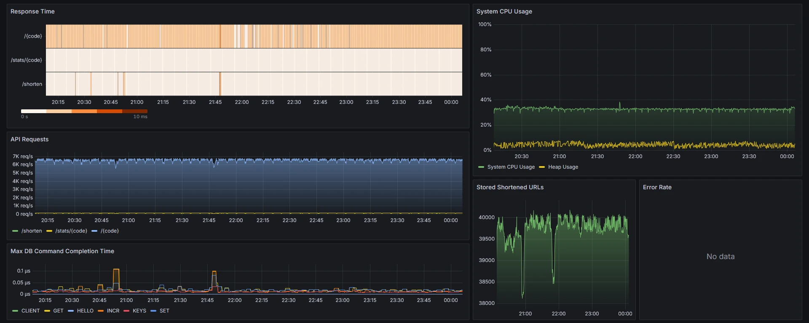

# URL Shortener

A URL shortener built with a focus on performance using Spring Boot. Takes long URLs and converts them into short codes
with click tracking and analytics.

## Features

Submit a long URL, get back an up to 5-character long code. Click the short link, get redirected to your original URL.
Check stats to see how many times it's been clicked.

```
https://very-very-long-url.com/it-sure-is-very-long-and-ugly/1234567890/goober 
becomes 
http://localhost:8080/kVOkZ
```

## Getting started

```bash
docker-compose up --build
```

- App: `http://localhost:8080`
- Swagger UI: `http://localhost:8080/swagger-ui/index.html`
- Prometheus: `http://localhost:9090`
- Grafana: `http://localhost:3000` (admin/admin)

## The ID scrambling

Instead of using randomized strings, which is a wasteful use of the 5-character space, or directly exposing sequential
database IDs (1, 2, 3...), the app scrambles them using reversible modulo arithmetic:

```
Auto-generated ID: 1 
(scramble with large number operations)
687194767
(convert to base62)
kVOkZ
```

This prevents people from guessing other URLs by incrementing the code. The scrambling is reversible, so `kVOkZ` always
maps back to ID 1.

## API

Shorten URL:

```bash
curl -X POST http://localhost:8080/shorten \
  -H "Content-Type: application/json" \
  -d '{"originalUrl": "https://example.com"}'
# Returns: {"shortCode": "kVOkZ"}
```

Use short URL:

```bash
curl http://localhost:8080/kVOkZ
# Redirects to https://example.com
```

Check stats:

```bash
curl http://localhost:8080/stats/kVOkZ
# Returns various stats
```

Auto-cleanup service removes unused URLs after 5 minutes since last usage (click or creation) for demonstration
purposes.

See `test.http` for example requests you can run directly.

## Tech stack

- Java 21 + Spring Boot
- Redis
- Protocol Buffers
- Prometheus + Grafana
- Docker Compose
- JUnit 5 + AssertJ + Mockito

## Technical choices and their impact on performance

- Redis - used for O(1) lookups. Comes with free TTL functionality which replaced the manual scheduled cleanup
  implementation. 5-10x speedup on all endpoints compared to SQLite
- Protocol buffers - replaced JSON with binary serialization. Lowered CPU usage by 15% and reduced endpoint latency by
  10-25%
- Asynchronous stats updates - stats are updated asynchronously from the main redirection flow, speeding up the redirect
  endpoint by 60-70%
- And many more small optimizations, like enabling virtual threads, ~~pre-compiling regexes~~ replacing regexes with
  direct char comparisons, etc. - 10-20% reduction in CPU usage and endpoint latency

### Why protocol buffers

| Data format      | Redirect endpoint latency @10kRPS load | Notes                                                                 |
|------------------|----------------------------------------|-----------------------------------------------------------------------|
| JSON             | 2.2-2.4ms                              | Default, simple implementation, but inefficient use of CPU and memory |
| Protocol buffers | 1.9-2.0ms                              | Much more efficient use of system resources, but more complex setup   |
| Raw KV pairs     | 1.6ms                                  | Fastest, but keeping track of all keys was becoming too complicated   |
| Redis hashes     | 4.2ms                                  | Easier to manage than raw KV pairs, but way too slow                  |

I chose Protocol buffers because despite the setup complexity, the code is simple and readable, while still being
much more efficient than JSON. Keeping track of all KV pairs and their TTLs manually was becoming too complicated, so I
decided not to use them even though the performance would benefit. I tried using hashes, but they turned out to be the
slowest in testing.


Screenshot of the Grafana dashboard during load testing