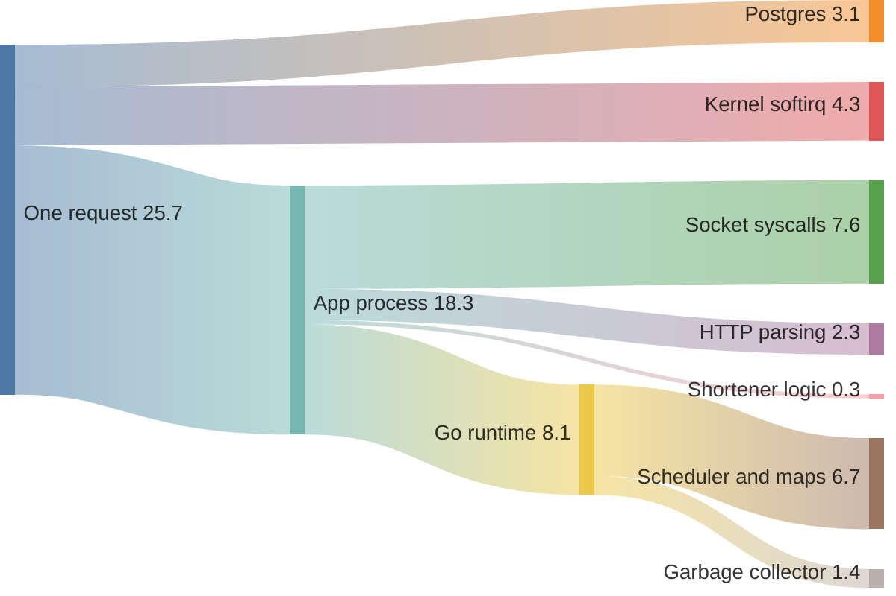

# URL Shortener

A URL shortener built with a focus on performance using Go. Takes long URLs and converts them into short codes that
expire from disuse, with click tracking and analytics.

https://very-very-long-url.com/it-sure-is-very-long-and-ugly/1234567890/goober becomes http://localhost:8080/kVOkZ

## Lore

This started as a Spring Boot-based performance optimization deep-dive, with a Redis store, protocol buffers instead of
JSON, and asynchronous stat updates. That implementation and its write-up are preserved in [
`README-spring.md`](README-spring.md)

The Go rewrite keeps the ID scrambling trick, but swaps pretty much the entire stack. Redis+protobufs became
Postgres+sqlc, and Spring Boot became standard Go. The performance focus remains.

## Getting started

```bash
cp .env.example .env
# Edit .env and fill in all required values
docker compose up -d --build
```

`test.http` has example requests for every endpoint.

## API

Shorten a URL:

```bash
curl -X POST http://localhost:8080/create -H "Content-Type: application/json" -d '{"original_url": "https://example.com"}'
```

Returns:

```json
{
  "short_code": "kVOkZ",
  "short_url": "http://localhost:8080/kVOkZ",
  "expires_at": "..."
}
```

Get redirected to the original URL, updating the stats and bumping the expiration date:

```bash
curl -i http://localhost:8080/kVOkZ
# 302 Location: https://example.com
```

Check the stats, without resetting the timer:

```bash
curl http://localhost:8080/stats/kVOkZ
```

Returns:

```json
{
  "short_code": "kVOkZ",
  "original_url": "https://example.com",
  "created_at": "...",
  "clicks": 21,
  "last_clicked_at": "...",
  "expires_at": "..."
}
```

There is also a browser UI on `/` that covers all features.

## How it works

### The ID scrambling

Instead of storing randomized strings, which wastes the 5-character space, or exposing sequential database IDs (1, 2,
3...), the app scrambles the `BIGSERIAL` id with reversible modular arithmetic and base62:

```
Auto-generated ID: 1
(multiply by a large prime, mod MaxValue)
687194767
(convert to base62)
kVOkZ
```

A code can be easily translated back and from its ID without producing visibly adjacent codes.

### Expiry

Links expire from disuse rather than fixed age. Creating or clicking a link resets its `expires_at` timestamp forward to
`now() + URL_TTL`, so a link that keeps getting traffic stays alive and one that goes quiet dies.

### Capacity

The 5-character Base62 space holds 916,132,830 links, which is every value the scrambler can produce.

Five characters is also the most a 64-bit multiply can handle. `Scramble` computes `id * LargePrime` before reducing it
mod `MaxValue`, and that intermediate has to fit in an `int64`, which requires `MaxValue^2 < 2^63`. Past it the multiply
overflows and `Encode` hands back an empty string.

Widening the space is a relatively straightforward change. It just needs a 128-bit intermediate and a new set of primes.

| Code length | Capacity          | Scramble             |
|-------------|-------------------|----------------------|
| 5 (current) | 916,132,830       | bare int64           |
| 6           | 56,800,235,582    | 128-bit intermediate |
| 7           | 3,521,614,606,206 | 128-bit intermediate |

916 million is plenty for now.

## Optimizations

**Soft expiry before deletion** - every read carries `AND expires_at > now()`, so a link appears dead on time, no matter
when the scheduled deletion sweep runs.

**One statement per click** - `ProcessClick` increments the counter, stamps `last_clicked_at`, pushes `expires_at`
forward and returns the URL all in a single query.

**No index except the primary key** - the scrambling trick makes the short code the ID, so the only index needed is the
primary key, on a column that never changes. Postgres can only do an in-place HOT update when no indexed column changes,
and every click rewrites `expires_at`, which used to be indexed to speed up expiry checks. That turned every click into
a full tuple rewrite.

Measured at 5,000 requests/s: dropping the index takes HOT updates from 0% to 98% and WAL per click from 394 B to 234 B,
at the same Postgres CPU usage. Throughput improvement is minor, at under 5%. Dropping the index is database hygiene
more than performance gains.

**In-memory cache in front of lookups** - a short code's URL is cached on creation and every database hit, with the
cache entries having the same TTL as the database rows. A cache hit skips the query entirely, short-circuiting the
redirect and recording the click asynchronously in the background. Measured:

| Requests/s | p50 uncached | p50 cached | p95 uncached | p95 cached |
|------------|--------------|------------|--------------|------------|
| 2,000      | 1.28 ms      | 0.09 ms    | 1.97 ms      | 0.17 ms    |
| 10,000     | 2.08 ms      | 0.09 ms    | 6.49 ms      | 0.40 ms    |
| 14,500     | 4.62 ms      | 0.12 ms    | 78.49 ms     | 0.81 ms    |
| 15,000     | 113.69 ms    | 0.12 ms    | 163.27 ms    | 0.85 ms    |
| 20,000     | 750.32 ms    | 0.23 ms    | 857.41 ms    | 26.56 ms   |

The uncached build degrades gradually from 2,000 to 14,500 requests/s, then falls off a cliff as it approaches the
~16,000 commits a second Postgres can sustain. The cached build does not visibly break anywhere in this table, because
the database backlog is masked by a cache that redirects from memory.

The write is still one `UPDATE` per click, just fired from a detached goroutine, so every click still costs a
transaction. Counting clicks that actually reached the table against the load window plus the time the app needed to
catch up afterward, the cached build is pinned: 16,216/s at 20,000 RPS, 16,020/s at 28,000 and 15,015/s at 40,000, while
the hidden backlog grows from 7 s to 22 s to 47 s. Both builds top out around 15,000-16,000 clicks/s because both are
doing the exact same write to Postgres.

**Batched click stats** - a cache hit sends a click event to a batching channel. One goroutine writes them in a single
`unnest` query, flushing on 4000 distinct IDs or one second. Measured:

| Requests/s | per-click landed/s | per-click backlog | batched landed/s | batched backlog |
|------------|--------------------|-------------------|------------------|-----------------|
| 10,000     | 9,677              | 1s                | 9,677            | 1s              |
| 20,000     | 16,216             | 7s                | 19,355           | 1s              |
| 30,000     | 15,892             | 26s               | 29,033           | 1s              |
| 40,000     | 15,015             | 47s               | 38,648           | 1s              |
| 50,000     | -                  | -                 | 48,387           | 1s              |
| 60,000     | -                  | -                 | 58,067           | 1s              |
| 70,000     | -                  | -                 | 67,745           | 1s              |

The per-click build is pinned at the same ~16,000 commits/s ceiling as the uncached one, since the cache didn't
eliminate the write transaction.

Batching thousands of clicks into one commit drops WAL per click from 198 B to 115 B and Postgres CPU from 104% to 37%.
The mechanism also bounds the backlog. Holding 30,000 requests/s over load windows of 30s, 60s and 120s, the per-click
build needs 25s, 51s and 109s to catch up, while the batched build needs 1s at every window. Sustained throughput goes
from ~16,000/s to ~75,000/s.

The new ceiling comes from the machine itself, not the app. Three runs with the app using various CPU counts:

| Stack   | Requests/s | p50     | p95      | Clicks lost | First failing rate |
|---------|------------|---------|----------|-------------|--------------------|
| 2 cores | 75,000     | 1.60 ms | 54.67 ms | 0           | 80,000             |
| 4 cores | 120,000    | 0.68 ms | 14.92 ms | 0           | 125,000            |
| 6 cores | 135,000    | 0.24 ms | 10.21 ms | 0           | 140,000            |

The smaller stacks stop because they run out of CPU. Six cores stops with capacity to spare, because past 135,000 the
network cost per request begins feeding back on itself. Latency rises, the load generator holds more connections open to
keep the offered rate up, kernel time per request climbs, and that raises latency again.

Profiled at 60,000 requests/s on the two-core stack, a request costs 25.7 us of CPU across the whole machine. Where the
CPU time actually goes, in microseconds:


```mermaid
sankey
One request,Postgres,3.1
One request,Kernel softirq,4.3
One request,App process,18.3
App process,Socket syscalls,7.6
App process,Go runtime,8.1
App process,HTTP parsing,2.3
App process,Shortener logic,0.3
Go runtime,Scheduler and maps,6.7
Go runtime,Garbage collector,1.4
```

0.3 us of the 25.7 is the shortener itself. There is nothing left to optimize in the app.

## Tech stack

- Go standard library
- Postgres + pgx
- ristretto for the lookup cache
- sqlc for handwritten SQL
- goose for migrations
- Docker Compose
